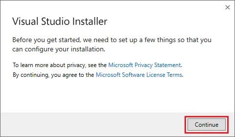

# Installation on Windows Platforms

Oracle GraalVM is available for Windows on the x64 architecture.

Follow these steps to install Oracle GraalVM:

1. Navigate to [Oracle Java Downloads](https://www.oracle.com/java/technologies/downloads/). Select the preferred Oracle GraalVM version, **22** for the Java version, and **Windows** for the operating system. Start downloading.

2. Change the directory to the location where you want to install GraalVM, then move the _.zip_ archive file to it.

3. Unzip the archive to your file system.

4. There can be multiple JDKs installed on the machine. The next step is to configure the runtime environment. Setting environment variables via the command line will work the same way for Windows 8, 10, and 11.
  - Set the `JAVA_HOME` environment variable to resolve to the installation directory:
    ```shell
    setx /M JAVA_HOME "C:\Progra~1\Java\<graalvm>"
    ```
  - Set the value of the `PATH` environment variable to the GraalVM _bin_ directory:
    ```shell
    setx /M PATH "C:\Progra~1\Java\<graalvm>\bin;%PATH%"
    ```  
  Note that the `/M` flag, equivalent to `-m`, requires elevated user privileges.

5. Restart Command Prompt to reload the environment variables. Then use the following command to check whether the variables were set correctly:
    ```shell
    echo %PATH%
    echo %JAVA_HOME%
    ```

Alternatively, you can set up environment variables through a Windows GUI:

1. Go to Windows Start Menu, then **Settings**, then **Advanced**.
2. Click **Environment Variables**. In the section labeled "System Variables" find the `JAVA_HOME` variable and select it.
3. Click **Edit**.
4. Click **New**.
5. Click **Browse** to find the directory to add. Confirm by clicking **OK**.
6. Restart Command Prompt to reload the environment variables.

Repeat the same for the `PATH` environment variable.

## Prerequisites for Native Image on Windows

On Windows, Native Image requires Visual Studio and Microsoft Visual C++(MSVC). 
You can use Visual Studio 2022 version 17.1.0 or later.

### Install Visual Studio Build Tools and Windows SDK

1. Download the Visual Studio Build Tools (C development environment) from [visualstudio.microsoft.com](https://visualstudio.microsoft.com/thank-you-downloading-visual-studio/?sku=BuildTools&rel=16){:target="_blank"}.

2. Start the Visual Studio Build Tools installation by clicking on the _.exe_ file, and then press Continue:

    

3. Check the **Desktop development with C++** box in the main window. Also, on the right side under Installation Details, choose **Windows SDK**, and click the Install button.

    

4. After the installation completes, reboot your system.

5. Next ensure Windows SDK is indeed available. Open the Visual Studio Installer:

    

6. Under the Installed tab, click Modify and choose Individual Components:

    

7. Then scroll to the bottom and check if Windows SDK is installed and confirm the build tools are checked:
  
    

Now that you have the Windows SDK and Visual Studio tooling installed, you can start using Oracle GraalVM Native Image.

### Start Using Native Image

Native Image sets up build environments automatically if it can find an appropriate Visual Studio installation in a known location.
With the GraalVM JDK on your `PATH`, you can therefore now run the `native-image` utility in a Command Prompt (`cmd`) or a PowerShell (`pwsh`).

To check the `native-image` version, run:
```shell
C:\> native-image.cmd --version
```

To build a project using the [Native Build Tools Maven plugin](https://graalvm.github.io/native-build-tools/latest/maven-plugin.html){:target="_blank"}, run:
```shell
mvnw.cmd native:compile
```

To build a project using the [Native Build Tools Gradle plugin](https://graalvm.github.io/native-build-tools/latest/gradle-plugin.html){:target="_blank"}, run:
```shell
gradlew.bat nativeCompile
```

This guide was written for Windows 10, but should be valid for Windows 8 and 11.